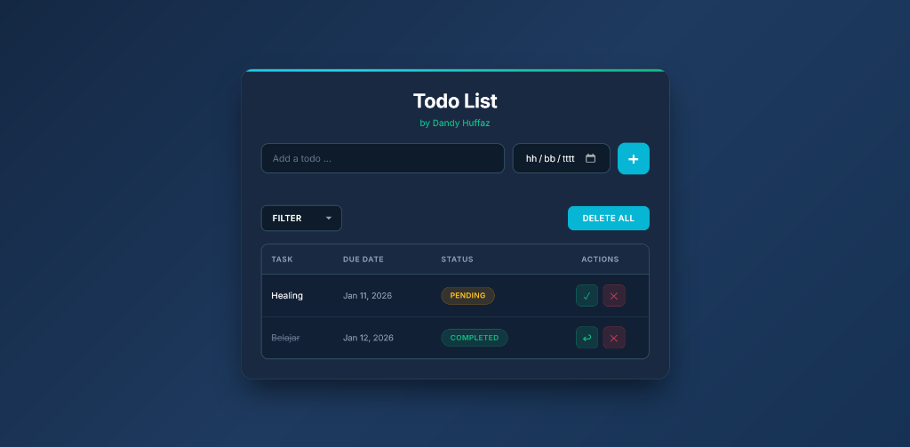

# ✨ Todo List Web Application

<div align="center">


[](https://developer.mozilla.org/en-US/docs/Web/HTML)
[](https://developer.mozilla.org/en-US/docs/Web/CSS)
[](https://developer.mozilla.org/en-US/docs/Web/JavaScript)
[](LICENSE)

**A modern, elegant, and fully functional To-Do List web application**

[Live Demo](#-live-demo) • [Features](#-features) • [Installation](#-installation) • [Usage](#-usage)

</div>

---

## 👨‍💻 Author

<div align="center">

| **Dandy Huffaz** |
|:---:|
| CodingCamp Batch 5 January 2026 |

</div>

---

## 🎯 About The Project

This is a **To-Do List Web Application** built as part of the CodingCamp Software Engineer training program. The application allows users to manage their daily tasks with a beautiful and intuitive interface.

### ✨ Key Highlights

- 🎨 **Modern Dark Theme** with teal/cyan gradient accents
- 📱 **Fully Responsive** design for all devices
- 💾 **Persistent Storage** using Local Storage API
- ⚡ **Smooth Animations** and micro-interactions
- ✅ **Form Validation** with visual feedback

---

## 🚀 Features

| Feature | Description |
|---------|-------------|
| ➕ **Add Tasks** | Create new tasks with custom due dates |
| 🗑️ **Delete Tasks** | Remove individual tasks or clear all |
| 🔍 **Filter Tasks** | Filter by All, Pending, or Completed status |
| ✅ **Toggle Status** | Mark tasks as complete or pending |
| 📅 **Date Picker** | Select due dates for better organization |
| 🔒 **Input Validation** | Prevents empty or invalid submissions |
| 💾 **Local Storage** | Tasks persist even after browser refresh |

---

## 🛠️ Tech Stack

<div align="center">

| Technology | Purpose |
|:---:|:---:|
|  | Structure |
|  | Styling |
|  | Logic |

</div>

---

## 📁 Project Structure

```
📦 To-Do-List-Web-Application
├── 📂 css
│   └── 📄 style.css       # All styles in one file
├── 📂 js
│   └── 📄 script.js       # All JavaScript in one file
├── 📄 index.html          # Main HTML file
└── 📄 README.md           # Project documentation
```

---

## 💻 Installation

1. **Clone the repository**
   ```bash
   git clone https://github.com/dandyhuffazichlamsyah/CodingCamp-5Jan26-DandyHuffaz.git
   ```

2. **Navigate to project directory**
   ```bash
   cd CodingCamp-5Jan26-DandyHuffaz
   ```

3. **Open in browser**
   - Simply open `index.html` in your preferred browser
   - Or use Live Server extension in VS Code

---

## 🎮 Usage

1. **Add a Task**
   - Type your task in the input field
   - Select a due date
   - Click the `+` button or press Enter

2. **Complete a Task**
   - Click the ✓ button to mark as complete
   - Click again to revert to pending

3. **Delete a Task**
   - Click the ✕ button to remove a specific task
   - Use "DELETE ALL" to clear everything

4. **Filter Tasks**
   - Use the dropdown to filter by status
   - Options: All Tasks, Pending, Completed

---

## 🌐 Live Demo

🔗 **[View Live Demo]([https://dandyhi.me/To-Do-List-Web-Application/](https://dandyhi.me/CodingCamp-5Jan26-dandyhuffaz/))**

---

## 📸 Screenshots

<div align="center">

### Desktop View

*Modern dark theme with teal accents*

</div>

---

## 🎨 Color Palette

| Color | Hex | Usage |
|:---:|:---:|:---:|
| 🔵 Cyan | `#06b6d4` | Primary Accent |
| 🔷 Light Cyan | `#22d3ee` | Secondary Accent |
| 🟢 Emerald | `#10b981` | Success/Complete |
| 🔴 Rose | `#f43f5e` | Delete/Danger |
| ⚫ Dark Blue | `#0a1628` | Background |

---

## 📝 Assignment Requirements

- [x] Form To-Do and Date Input
- [x] Display To-Do List
- [x] Add, Filter, and Delete functionality
- [x] Validate Input Form
- [x] CSS in `css/` folder (single file)
- [x] JavaScript in `js/` folder (single file)
- [x] Published on GitHub Pages

---

## 🙏 Acknowledgments

- **CodingCamp** - For the amazing training program
- **Google Fonts** - Inter font family
- **Inspiration** - Modern web design trends

---

<div align="center">

### ⭐ If you like this project, give it a star!

Made with ❤️ by **Dandy Huffaz**

[](https://github.com/dandyhuffazichlamsyah)

</div>
